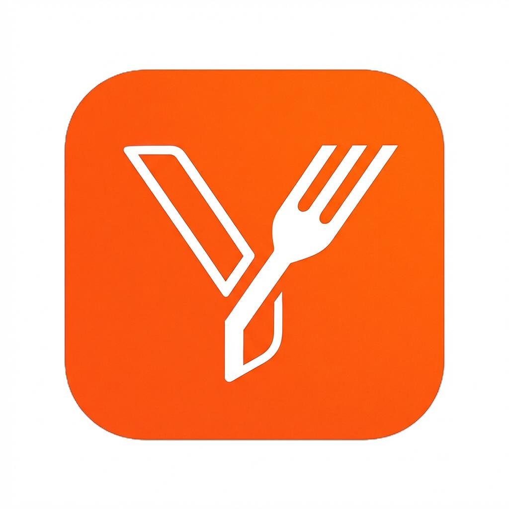
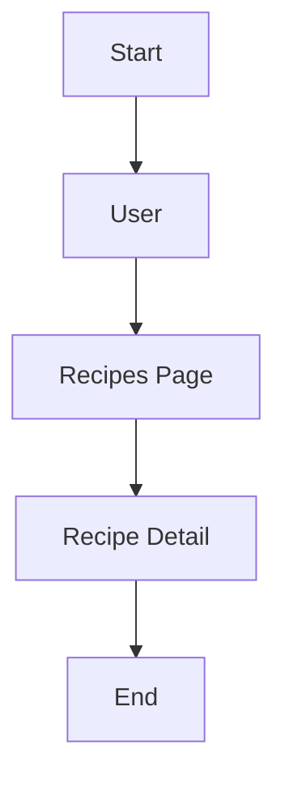
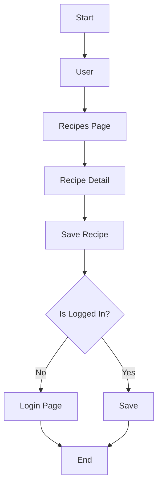
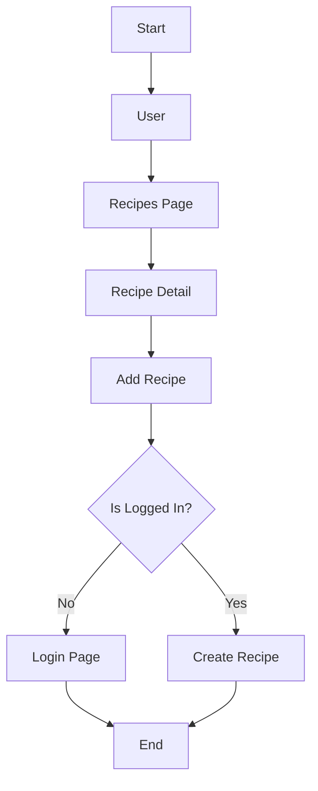

Share not only recipes but also loves. Made with ❤️ by [San Linn Phyo](https://github.com/devsanlphyo).

### Overview

- [About](#about)
- [How It Is Structured](#how-it-is-structured)
- [Features](#features)
- [Process Flows](#process-flows)
- [Tasks Overview](#tasks-overview)

<h3 id="about">About</h3>

YourRecipes (YR) is a recipe sharing website. It has a lot of recipes that you would like and you can share your favorite recipes too. Browse, save and share.

<h3 id="how-it-is-structured">How It Is Structured</h3>

NextJs is used to built Frontend while powering backend by ASP.NET Core Web API.

```bash
YourRecipes/
|----------- YourRecipes.Database
|----------- YourRecipes.Domain
|----------- YourRecipes.WebAPI
|----------- YourRecipes.Website
```

<h3 id="features">Features</h3>

- **Recipe Sharing**
Users can create and share their favorite recipes with the community.
- **Recipe Browsing**
Browse recipes by categories, ingredients, cooking time, and other useful filters.
- **Save Favorite Recipes**
Save recipes you love and easily access them later.
- **Recipe Details**
View ingredients, instructions, preparation time, cooking time, servings, and other recipe information.
- **User Accounts**
Users can create an account and manage their own recipes and saved recipes.

<h3 id="process-flows">Process Flows</h3>

- Browse




- Save




- Share



<h3 id="tasks-overview">Tasks Overview</h3>

* [x] Design Entities and ERD For MVP (Browsing)
* [ ] Build Database using EF Core DB First Approach
* [ ] Build Domain
* [ ] Build WebAPI
* [ ] Build Frontend


<br />
<br />
<br />
<br />
<br />

> Made with ❤️ by [San Linn Phyo](https://github.com/devsanlphyo)…
>